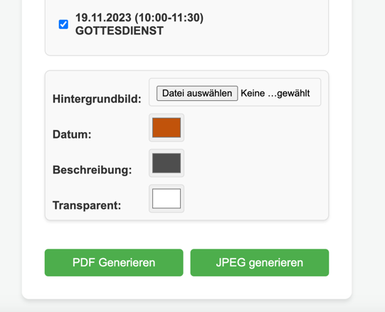
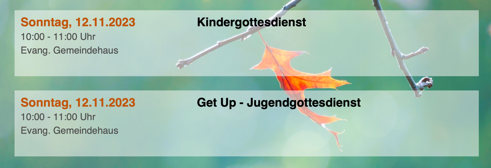

# ChurchTools API

This repository provides a user-friendly interface to access the ChurchTools API.

It was created to fulfill the need of displaying all appointments from [evkila.de](https://www.evkila.de/) on a single PDF file or as multiple JPEG images.

## Features

### Main Dashboard with Multiple Functions


### Calendar Selection
Select one or more public calendars to view and manage appointments:


### Export Options
Generate formatted PDF documents or JPEG images with customizable styling:


### Output Example
Example of a generated appointment list:


## Setup Instructions

### Local Development Setup

1. Create and activate a virtual environment:
   ```bash
   python -m venv venv
   source venv/bin/activate  # On Windows: venv\Scripts\activate
   pip install -r requirements.txt
   ```

2. Edit the `Dockerfile` to configure your ChurchTools instance:
   ```dockerfile
   ENV  CHURCHTOOLS_BASE=evkila.church.tools \
        DB_PATH=/app/data/evkila.db
   ```

3. Run the application using the provided shell script:
   ```bash
   ./run.sh
   ```

4. Access the application in your browser:
   [http://127.0.0.1:5005/](http://127.0.0.1:5005/)

## Docker Deployment

To build and push a Docker image with the latest changes:

```bash
./build-and-push-docker-image.sh
```

This script will run all tests before building the Docker image to ensure code quality.

