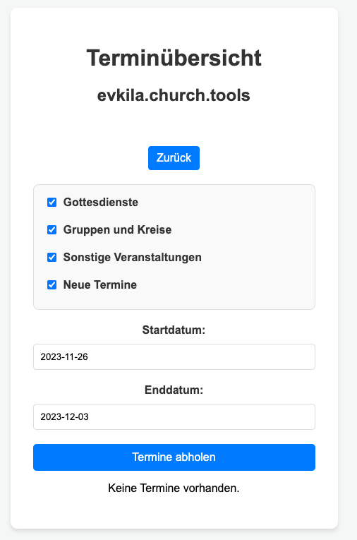
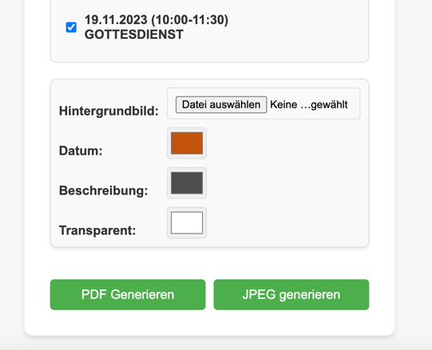
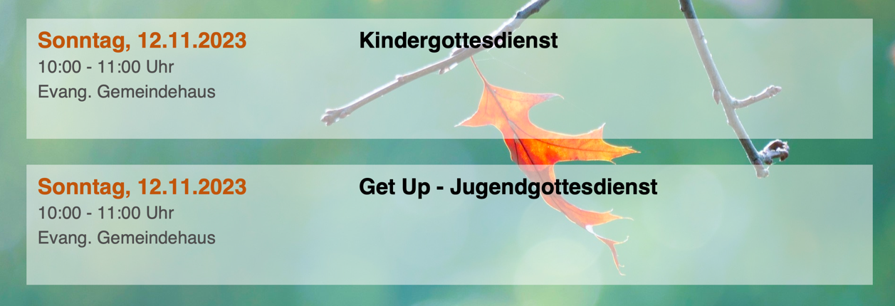

# ChurchTools API

This repository provides a user-friendly interface to access the ChurchTools API.

It was created to fulfill the need of displaying all appointments from [evkila.de](https://www.evkila.de/) on a single PDF file or as multiple JPEG images.

## Features

### Main Dashboard with Multiple Functions


### Calendar Selection
Select one or more public calendars to view and manage appointments:


### Export Options
Generate formatted PDF documents or JPEG images with customizable styling:


### Output Example
Example of a generated appointment list:


## Setup Instructions

### Prerequisites

- Python 3.12+
- Podman or Docker (for containerized deployment)

### Configuration

Copy the example environment file and fill in your values:

```bash
cp .env.example .env
```

```env
CHURCHTOOLS_BASE=your-instance.church.tools
DB_PATH=your-instance.db
```

### Local Development

```bash
python -m venv venv
source venv/bin/activate  # On Windows: venv\Scripts\activate
pip install -r requirements-dev.txt
make run
```

Access the application at [http://127.0.0.1:5005/](http://127.0.0.1:5005/)

### Available Make Commands

| Command       | Description                                  |
|---------------|----------------------------------------------|
| `make run`    | Start dev server with auto-reload            |
| `make test`   | Run test suite                               |
| `make lint`   | Check code style with ruff                   |
| `make format` | Auto-fix code style                          |
| `make build`  | Build container image locally                |
| `make push`   | Build and push multi-arch image to Docker Hub|

## Docker / Podman Deployment

### Run locally

```bash
./run_local_docker.sh
```

Builds the image, starts a container with your `.env` configuration and a `data/` volume for the SQLite database. Automatically cleans up any previous container.

### Build and push to Docker Hub

```bash
./build-and-push-docker-image.sh
```

The script auto-detects Podman or Docker, checks your Docker Hub login, and builds a multi-architecture image (amd64 + arm64). The version is defined at the top of the script.

## Synology NAS Deployment

### Initial Setup

1. Open **Container Manager** on your Synology NAS
2. Go to **Registry** → search for `schowave/churchtools` → **Download** → select `latest`
3. Go to **Image** → select `schowave/churchtools:latest` → **Run**
4. Configure the container:

**General:**

| Setting | Value |
|---|---|
| Container Name | `schowave-churchtools-1` |
| Auto-Restart | Enable if desired |

**Port:**

| Container Port | Host Port | Protocol |
|---|---|---|
| 5005 | 56276 (or any free port) | TCP |

**Volume:**

| Host Path | Container Path | Mode |
|---|---|---|
| `/volume1/docker/churchtools` | `/app/data` | Read/Write |

Create the host directory beforehand if it doesn't exist.

**Environment Variables (already set in image):**

| Variable | Value |
|---|---|
| `CHURCHTOOLS_BASE` | `evkila.church.tools` |
| `DB_PATH` | `/app/data/evkila.db` |

These are baked into the image as defaults. Override them in the container settings if you need different values.

5. Click **Run** to start the container
6. Access the app at `http://<your-nas-ip>:56276`

### Updating to a New Version

1. **Registry** → search `schowave/churchtools` → **Download** (`latest`)
2. **Container** → select `schowave-churchtools-1` → **Stop**
3. **Action** → **Reset** (recreates the container from the new image, keeps your settings)
4. **Start**

Your data in `/volume1/docker/churchtools` is preserved across updates.

## Contributing

```bash
pip install -r requirements-dev.txt
make lint      # check before committing
make test      # run the full test suite
```

CI runs lint and tests on every pull request to `main`. Branch protection (require passing CI, require PR review) is a manual GitHub setting on the repository.
