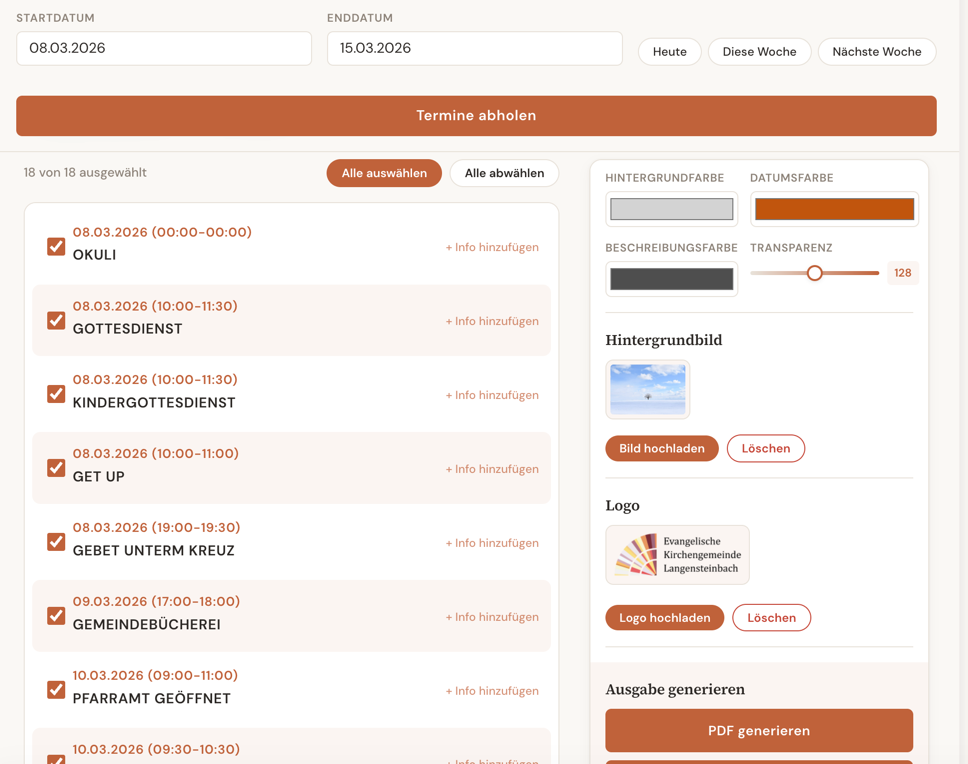

# ChurchTools API

[](https://github.com/schowave/churchtools-api/actions/workflows/test-and-build.yml)
[](https://hub.docker.com/r/schowave/churchtools)
[](https://www.python.org/downloads/)
[](LICENSE)

A web application for viewing and exporting appointments from any [ChurchTools](https://www.church.tools/) instance as styled PDF documents or JPEG images.

<p align="center">
  
</p>

## Features

- **Calendar selection** — choose one or more public calendars from your ChurchTools instance
- **PDF & JPEG export** — generate formatted appointment lists with customizable styling
- **Responsive dashboard** — manage calendars, formatting, and exports from a single interface


## Quick Start

### Docker (recommended)

```bash
docker run -d \
  -e CHURCHTOOLS_BASE=your-instance.church.tools \
  -v ./data:/app/data \
  -p 5005:5005 \
  schowave/churchtools:latest
```

Open [http://localhost:5005](http://localhost:5005)

### From Source

```bash
git clone https://github.com/schowave/churchtools-api.git
cd churchtools-api
cp .env.example .env           # set CHURCHTOOLS_BASE
python -m venv venv && source venv/bin/activate
pip install -e ".[dev]"
make run
```

## Configuration

| Variable | Required | Default | Description |
|---|---|---|---|
| `CHURCHTOOLS_BASE` | Yes | — | Your ChurchTools domain (e.g. `my-church.church.tools`) |
| `DB_PATH` | No | `churchtools.db` | Path to the SQLite database file |

## Deployment

### Synology NAS

1. Create a project folder on your NAS (e.g. `/volume1/docker/churchtools/`)
2. Add the `docker-compose.yml` from this repository
3. Create a `.env` file with your configuration:

   ```env
   CHURCHTOOLS_BASE=your-instance.church.tools
   ```

4. In **Container Manager** → **Project** → **Create**, point to the folder and start

The included [Watchtower](https://containrrr.dev/watchtower/) service monitors Docker Hub and automatically updates the container when a new release is published.

### Other Platforms

The Docker image `schowave/churchtools` is built for `linux/amd64` and `linux/arm64`. It works on any platform that supports Docker or Podman.

```yaml
# docker-compose.yml
services:
  churchtools-api:
    image: schowave/churchtools:latest
    ports:
      - "5005:5005"
    volumes:
      - ./data:/app/data
    environment:
      - CHURCHTOOLS_BASE=your-instance.church.tools
    restart: unless-stopped
```

## Releases

Releases are managed via GitHub Actions:

1. Go to **Actions** → **Release** → **Run workflow**
2. Either enter a version number (e.g. `3.1.0`) or leave empty to auto-increment the patch version (e.g. `3.0.2` → `3.0.3`)
3. The workflow runs tests, updates `pyproject.toml`, creates a git tag, builds a multi-arch Docker image, and pushes to Docker Hub
4. Watchtower picks up the new image automatically on connected hosts

> Requires GitHub Secrets: `DOCKERHUB_USERNAME` and `DOCKERHUB_TOKEN`

## Development

| Command | Description |
|---|---|
| `make run` | Start dev server with auto-reload |
| `make test` | Run test suite |
| `make lint` | Check code style (ruff) |
| `make format` | Auto-fix code style |
| `make build` | Build container image locally |

CI runs lint and tests on every push to `main` and on pull requests.
