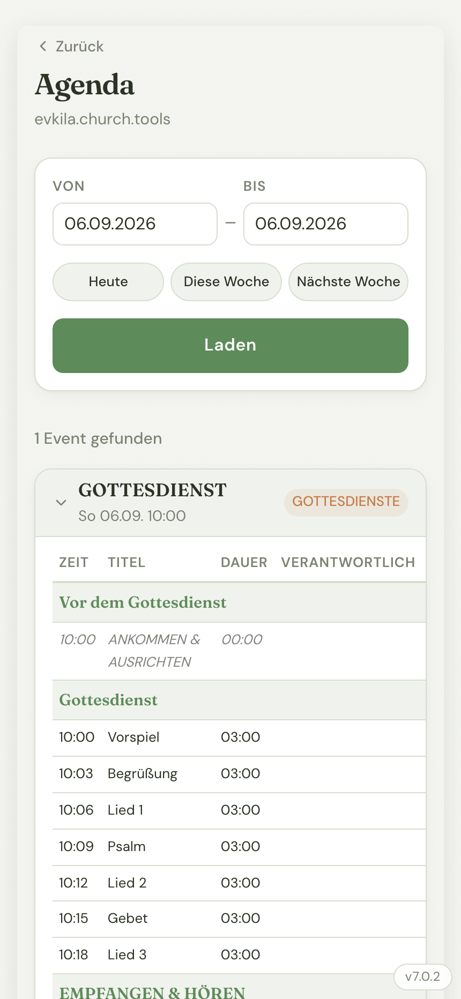
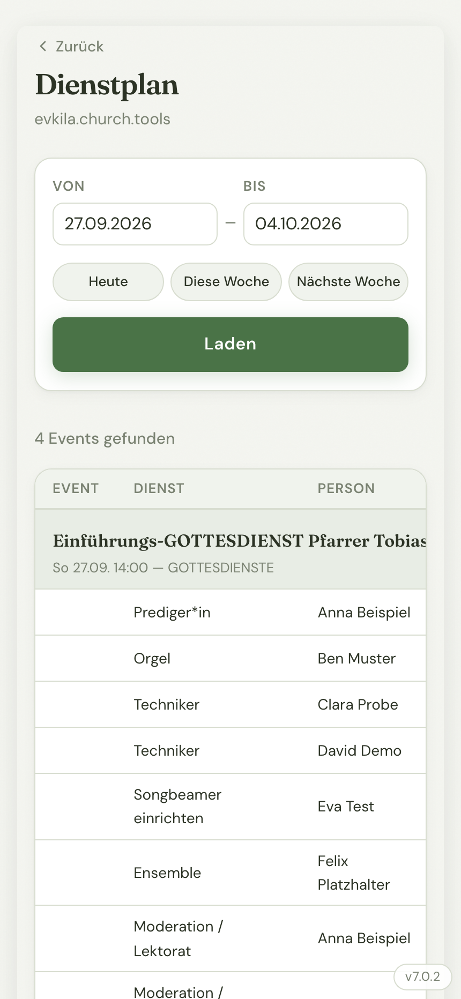
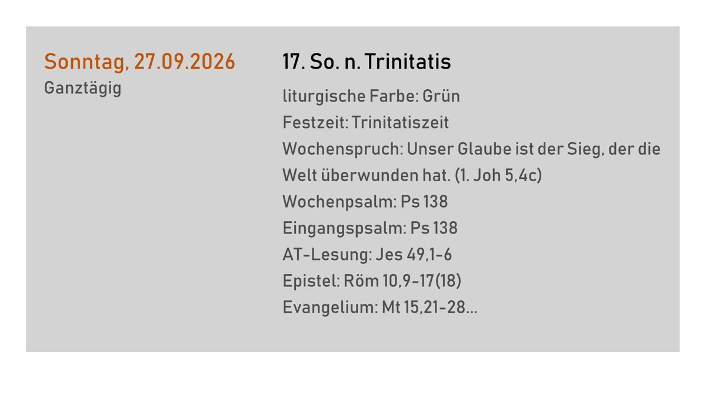

# ChurchTools API

[](https://github.com/schowave/churchtools-api/actions/workflows/test-and-build.yml)
[](https://hub.docker.com/r/schowave/churchtools)
[](https://www.python.org/downloads/)
[](LICENSE)

A web application for creating styled announcement slides from [ChurchTools](https://www.church.tools/) calendar events — exported as PDF or JPEG for use in church services.

<p align="center">
  
  
</p>
<p align="center">
  
  
</p>
<p align="center">
  
</p>

## Features

- **Termin-Folien** — styled announcement slides from calendar appointments, exported as PDF or JPEG (ZIP), with custom colors, logo, and background image
- **Agenda** — service rundowns (songs, items, responsible persons) per event, exportable as PDF
- **Dienstplan** — who serves in which role per event, exportable as PDF per event
- **Calendar selection** — choose one or more public calendars from your ChurchTools instance


## Quick Start

### Docker (recommended)

```bash
docker run -d \
  -e CHURCHTOOLS_BASE=your-instance.church.tools \
  -v ./data:/app/data \
  -p 5005:5005 \
  schowave/churchtools:latest
```

Open [http://localhost:5005](http://localhost:5005)

### From Source

```bash
git clone https://github.com/schowave/churchtools-api.git
cd churchtools-api
cp .env.example .env           # set CHURCHTOOLS_BASE
mise install                   # installs Python + uv, creates .venv
mise run install               # installs app + dev dependencies
mise run run
```

## Configuration

| Variable | Required | Default | Description |
|---|---|---|---|
| `CHURCHTOOLS_BASE` | Yes | — | Your ChurchTools domain (e.g. `my-church.church.tools`) |
| `DB_PATH` | No | `churchtools.db` | Path to the SQLite database file |
| `TIMEZONE` | No | `Europe/Berlin` | Timezone for date display (any valid IANA timezone) |
| `LOG_FORMAT` | No | `console` | Log output format: `console` (human-readable) or `json` |
| `FORWARDED_ALLOW_IPS` | No | `127.0.0.1` | Addresses of reverse proxies whose `X-Forwarded-*` headers are trusted (read by uvicorn). See [Behind a reverse proxy](#behind-a-reverse-proxy) |

Colors, logo and background image are shared by everyone who logs in: there is one set of settings per installation, and each export saves the colors used.

## Deployment

### Synology NAS

1. Create a project folder on your NAS (e.g. `/volume1/docker/churchtools/`)
2. Add the `docker-compose.yml` from this repository
3. Create a `.env` file with your configuration:

   ```env
   CHURCHTOOLS_BASE=your-instance.church.tools
   ```

4. In **Container Manager** → **Project** → **Create**, point to the folder and start

The included [Watchtower](https://containrrr.dev/watchtower/) service monitors Docker Hub and automatically updates the container when a new release is published.

### Other Platforms

The Docker image `schowave/churchtools` is built for `linux/amd64`. It works on any x86_64 platform that supports Docker or Podman.

```yaml
# docker-compose.yml
services:
  churchtools-api:
    image: schowave/churchtools:latest
    ports:
      - "5005:5005"
    volumes:
      - ./data:/app/data
    environment:
      - CHURCHTOOLS_BASE=your-instance.church.tools
    restart: unless-stopped
```

### Behind a reverse proxy

When the app runs behind a reverse proxy (Synology reverse proxy, Traefik, nginx, Caddy), set `FORWARDED_ALLOW_IPS` to the proxy's address as seen from the container, for example its Docker network address or `*` if the container port is only reachable through the proxy. Without it the app sees every request as coming from the proxy over HTTP:

- the login rate limit counts all users as one client, so a few failed logins lock everyone out for five minutes
- cookies are not marked `Secure` and no HSTS header is sent

Do not set `*` if port 5005 is reachable directly: clients could then fake their IP address and bypass the login rate limit.

The container starts as root only to hand the data volume to the unprivileged `app` user, then runs the app as that user.

## Releases

Releases are managed via GitHub Actions:

1. Go to **Actions** → **Release** → **Run workflow**
2. Either enter a version number (e.g. `3.1.0`) or leave empty to auto-increment the patch version (e.g. `3.0.2` → `3.0.3`)
3. The workflow runs tests, updates `pyproject.toml`, creates a git tag, builds the Docker image (linux/amd64), and pushes to Docker Hub
4. Watchtower picks up the new image automatically on connected hosts

> Requires GitHub Secrets: `DOCKERHUB_USERNAME` and `DOCKERHUB_TOKEN`

## Development

Tooling is managed with [mise](https://mise.jdx.dev/) (`mise.toml`): it pins Python and uv and activates `.venv` automatically. Run `mise tasks` for the full list.

| Command | Description |
|---|---|
| `mise run install` | Install app and dev dependencies into `.venv` |
| `mise run run` | Run migrations and start dev server with auto-reload |
| `mise run test` | Run test suite |
| `mise run cov` | Run test suite with coverage report |
| `mise run lint` | Check code style (ruff) |
| `mise run format` | Auto-fix code style |
| `mise run audit` | Check pinned runtime dependencies for known vulnerabilities (pip-audit) |
| `mise run smoke` | Start the built image and check health, login page and static files |
| `mise run scan` | Scan the locally built image for fixable HIGH/CRITICAL vulnerabilities (trivy) |
| `mise run login` | Log in via browser against the running app and save the session to `.auth/` for scripted checks |
| `mise run login-clear` | Delete the saved session (contains your ChurchTools login token) |
| `mise run preview` | Render a sample slide PDF to `app/saved_files/preview.pdf` |
| `mise run lock` | Regenerate `requirements.txt` (pinned, hashed runtime deps for the Docker image) |
| `mise run build` | Build container image locally (podman) |
| `mise run run-docker` | Build and run the container locally with `./data` as volume |

Local JPEG export needs poppler (`brew install poppler` / `apt install poppler-utils`); the Docker image ships it.

Dependencies are declared in `pyproject.toml`. After changing them, run `mise run lock` so the Docker image picks up the new pins.

CI runs lint, tests, the dependency audit, and the image scan on every push to `main` and on pull requests.
